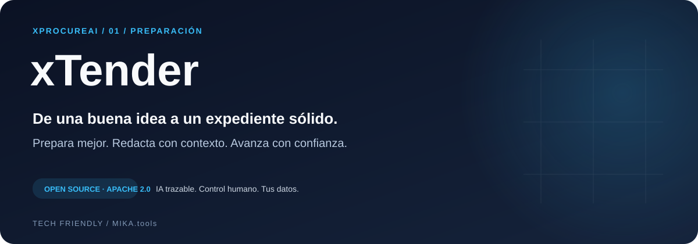

<p align="center"></p>

<p align="center">
  <a href="LICENSE"></a>
  <a href="https://github.com/techfriendly/xProcureAI"></a>
  <a href="docs/GETTING_STARTED.md"></a>
  <a href="CONTRIBUTING.md"></a>
</p>

# xTender

## De una buena idea a un expediente sólido.

**Prepara mejor. Redacta con contexto. Avanza con confianza.**

Cada contrato empieza mucho antes de publicarse. xTender convierte necesidades, precedentes y conocimiento de tu organización en un espacio de trabajo para planificar, redactar y revisar expedientes con IA. Del primer porqué al último capítulo, tu equipo conserva el criterio y el control.

[Empezar](docs/GETTING_STARTED.md) · [Explorar xProcureAI](https://github.com/techfriendly/xProcureAI) · [Roadmap](ROADMAP.md) · [Contribuir](CONTRIBUTING.md)

## Lo que cambia en tu día a día

### Empieza con las preguntas adecuadas

Entrevistas guiadas para informe de necesidad, PPT y PCAP. Cada documento sigue su propia estructura y comparte los datos del expediente.

### Escribe con contexto

Redacción por capítulos apoyada en fuentes, plantillas y referencias seleccionadas. Revisa la propuesta, compara versiones y conserva tus ediciones.

### Conecta las piezas

Comprueba la coherencia entre objeto, presupuesto, lotes, plazos, CPV, entregables y condiciones. Las propagaciones de cambios pasan por revisión.

### Planifica antes de redactar

Plan anual, estudios de mercado, escenarios, riesgos, cronogramas y cálculo versionado de presupuesto base y valor estimado.

### Convierte conocimiento en capacidad

Exploradores de licitaciones y fuentes jurídicas, catálogo de cláusulas, plantillas reutilizables y búsquedas guardadas.

### Llévate todo el expediente

DOCX para trabajar y ZIP con documentos, datos, versiones, fuentes disponibles, auditoría y hashes para conservar la trazabilidad.

## Un recorrido pensado para trabajar

```text
Necesidad → planificación → fuentes y plantilla → índice validado → redacción → revisión → exportación
```

**Para quién:** Equipos de contratación, servicios técnicos y asesorías jurídicas que quieren preparar expedientes con más contexto y menos trabajo repetitivo.

## Potencia de IA. Responsabilidad humana.

Las propuestas generadas conservan sus fuentes y pasan por revisión. Los cambios relevantes, validaciones y exportaciones dejan trazabilidad. Puedes adaptar el código, configurar tu infraestructura y elegir un servidor de modelos compatible con la API de chat de OpenAI.

**Estado del proyecto:** versión inicial en desarrollo activo. Las capacidades descritas están presentes en el código; su disponibilidad completa depende de la configuración de los servicios. Las decisiones administrativas corresponden a las personas autorizadas.

El corpus documental empieza vacío. La generación requiere un LLM configurado; la recuperación semántica requiere embeddings y Milvus. El backend determinista de embeddings está reservado a pruebas. La documentación de instalación explica cómo incorporar tus propias fuentes.

## Empieza por tu propio entorno

```bash
git clone https://github.com/techfriendly/xTender.git
cd xTender
cp .env.local.example .env.local
```

Continúa con [la guía de instalación](docs/GETTING_STARTED.md): dependencias, credenciales, servicios y comandos de arranque. Puertos de referencia: **web `3000`**, **API `8000`**. No se incluyen datos ni documentos reales.

## Una pieza de una visión completa

**xProcureAI: de la necesidad al contrato cumplido.** Empieza por el módulo que necesitas y conecta el resto del ciclo cuando tu organización esté preparada.

| Módulo | Momento | Resultado |
| --- | --- | --- |
| [xTender](https://github.com/techfriendly/xTender) | Preparar | Necesidades, planificación y documentos coordinados. |
| [xReview](https://github.com/techfriendly/xReview) | Evaluar | Evidencias, valoración revisada y adjudicación trazable. |
| [xFollow](https://github.com/techfriendly/xFollow) | Ejecutar | Obligaciones, seguimiento y cumplimiento documentado. |

Los módulos tienen aplicaciones y esquemas propios. La integración actual utiliza un PostgreSQL compartido y referencias documentales; consulta la [arquitectura de la suite](https://github.com/techfriendly/xProcureAI/blob/main/docs/ARCHITECTURE.md).

## Código abierto para construir en común

[Arquitectura](docs/ARCHITECTURE.md) · [Uso](docs/USER_GUIDE.md) · [Fuentes y datos](docs/DATA_POLICY.md) · [Datos](docs/DATA_POLICY.md) · [Seguridad](SECURITY.md)

¿Quieres mejorar la contratación pública con software abierto? [Propón una mejora](https://github.com/techfriendly/xTender/issues/new/choose), comparte un caso de uso con datos ficticios o envía tu primera PR siguiendo [CONTRIBUTING.md](CONTRIBUTING.md).

**Apache 2.0.** Puedes usar, estudiar, modificar y redistribuir el software bajo los términos de [LICENSE](LICENSE). Dependencias y modelos mantienen sus licencias respectivas. Impulsado por **TECH friendly**, dentro del ecosistema **MIKA.tools**.

Consulta [licencia y entrega del software](LICENSING.md) y [componentes de terceros](THIRD_PARTY_NOTICES.md), incluido el régimen AGPL/comercial de PyMuPDF.

[Implantación, soporte y servicios profesionales](SERVICES.md): contratación separada, con el código propio bajo Apache 2.0.
